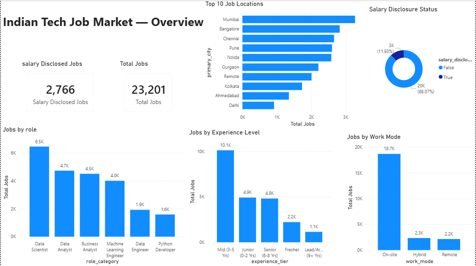
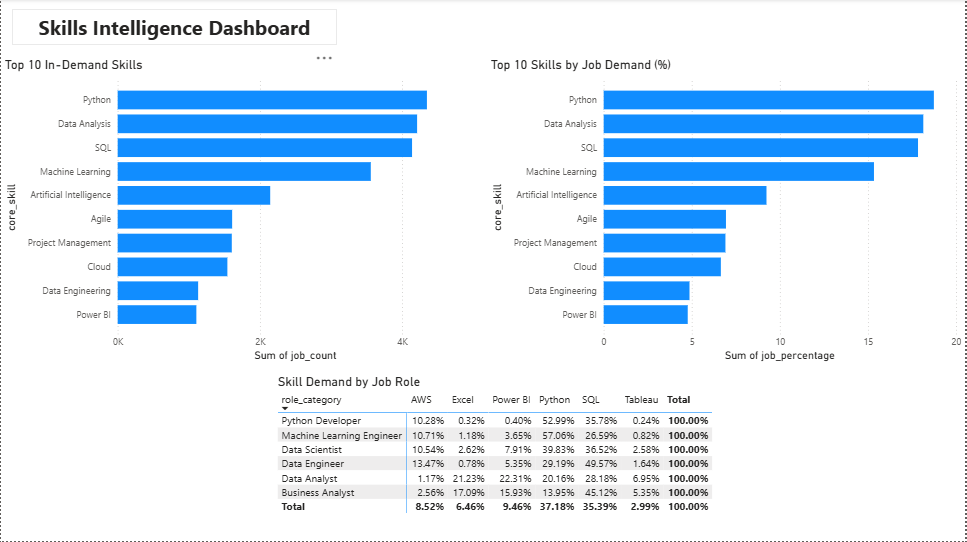
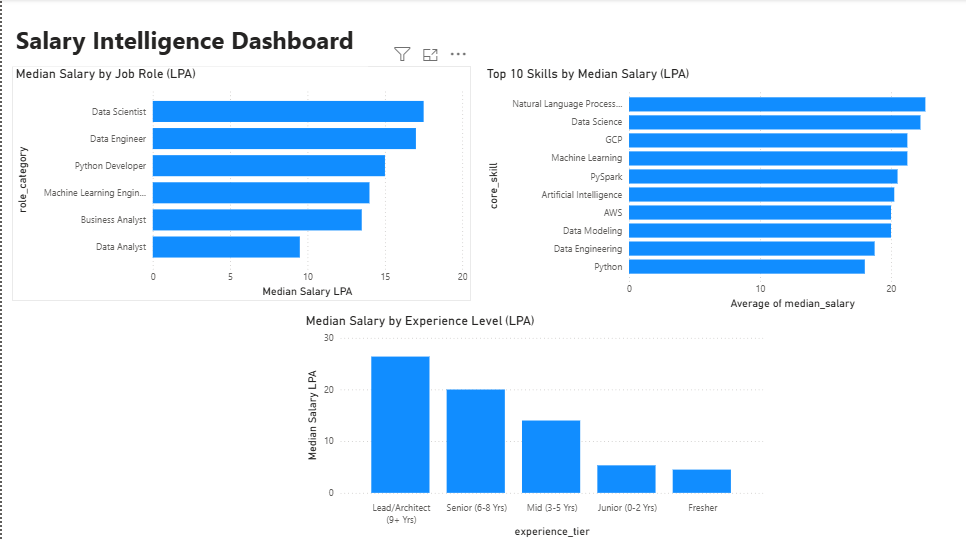
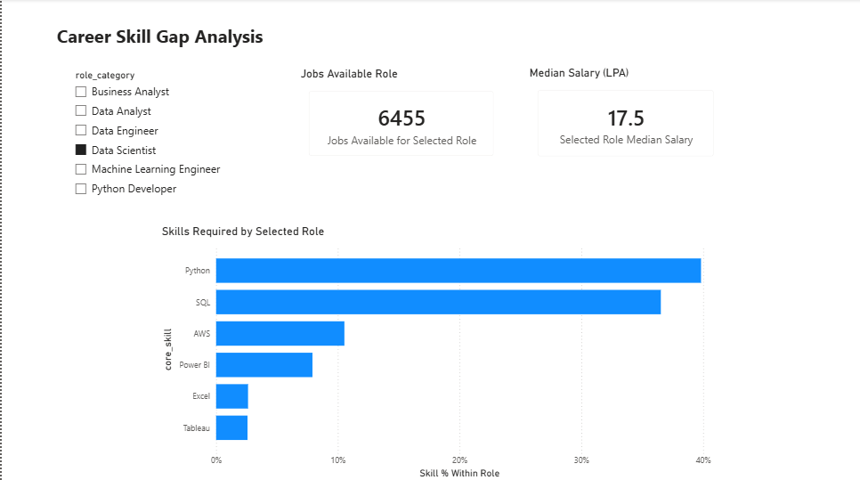

# Job Market Skills & Salary Intelligence Platform


📊 Project Overview

The Job Market Skills & Salary Intelligence Platform is a Data Analytics project that analyzes the Indian technology job market to identify in-demand skills, salary patterns, job roles, experience levels, work modes, and career skill gaps.


The project uses Python for data cleaning and analysis and Power BI to build an interactive dashboard for exploring job-market trends.


🎯 Project Objectives

\- Analyze the demand for different technical skills.

\- Identify the most common technology job roles.

\- Analyze salary ranges and median salaries.

\- Understand salary differences across experience levels.

\- Analyze job availability by work mode and location.

\- Identify the key skills required for different job roles.

\- Help job seekers understand skill requirements for their target roles.


 📁 Dataset

The project uses a dataset containing \*\*23,201 Indian technology job postings\*\*.

The dataset includes information such as:

\- Job title

\- Job role/category

\- Required skills

\- Experience level

\- Salary information

\- Work mode

\- Job location

\- Company information

\- Other job-related attributes


Salary information is available for a subset of the job postings.


 🛠️ Technologies Used
 Programming & Data Analysis

\- Python

\- Pandas

\- NumPy

\- Matplotlib

\- Jupyter Notebook


*Database & Querying

\- SQL


\*Business Intelligence

\- Microsoft Power BI

\- DAX


\*Development Tools

\- VS Code

\- Git

\- GitHub


\🔄 Project Workflow


```text

Raw Job Market Data

&#x20;       ↓

Data Cleaning & Preprocessing

&#x20;       ↓

Skill Extraction & Normalization

&#x20;       ↓

Exploratory Data Analysis

&#x20;       ↓

Salary & Experience Analysis

&#x20;       ↓

Role-Skill Analysis

&#x20;       ↓

Processed CSV Files

&#x20;       ↓

Power BI Dashboard

&#x20;       ↓

Career Skill Gap Analysis

---

## 📊 Power BI Dashboard Preview

### 1. Job Market Overview



### 2. Skills Intelligence



### 3. Salary Intelligence



### 4. Career Skill Gap Analysis


---

## 📊 Power BI Dashboard Preview

### 1. Job Market Overview


### 2. Skills Intelligence


### 3. Salary Intelligence


### 4. Career Skill Gap Analysis

